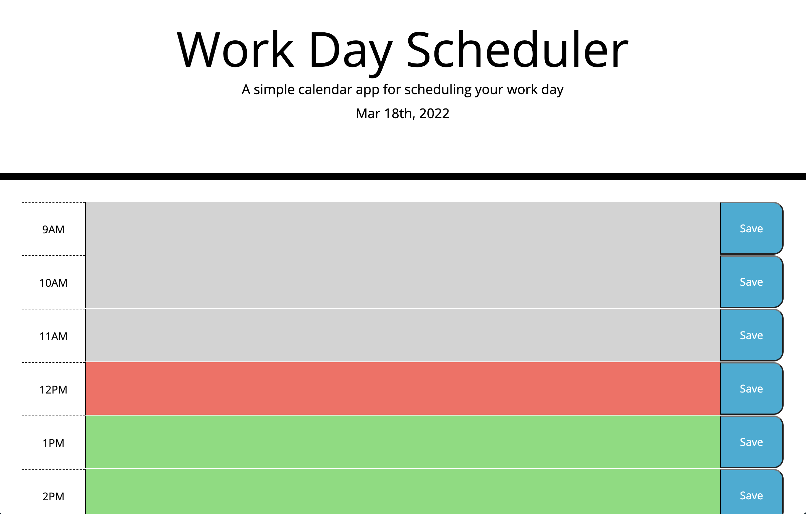

## Title: Planner

## Links
Git Hub:https://github.com/Lexi-Diamond/planner.git
Live URL: https://lexi-diamond.github.io/planner/

## Technologies Used 
This project used HTML, CSS, Javascript, jQuery and Moment

## Description
When a user navigates to the page they are presented with time blocks for each hour of the work day where they can enter a task into the form in each time block and save it. When the user refreshes the page the tasks will remain on the page. Each hour is color coded for organization, past hours will display grey, current hour will display red and future hours will display green. 

# Images/Screenshots

